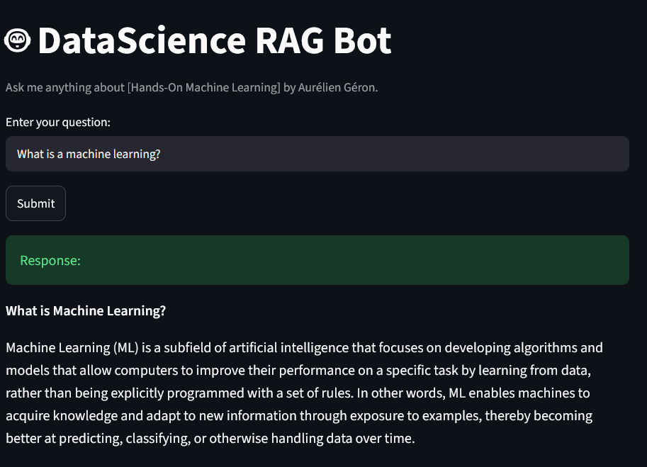

# Hands-On ML RAG Bot 🤖

*Created by [Ali Hmidov](https://github.com/Alihmidov) | [View on GitHub](https://github.com/Alihmidov/hands-on-rag-groq)*

**[🚀 TRY THE LIVE BOT HERE](https://hands-on-rag-groq-1.onrender.com)**
> ⏳ *Hosted on Render's free tier — first load may take up to 1 minute to wake up. Please wait, it will load!*

Here is how the bot looks in action:



This project is an AI-powered assistant designed to help you interact with the "Hands-On Machine Learning" book by Aurélien Géron. Using RAG (Retrieval-Augmented Generation) technology, it allows you to ask questions and get accurate answers directly from the book's content.

## Purpose

The goal of this project is to provide a fast and efficient way to query technical information about machine learning concepts without needing to manually search through hundreds of pages.

## What It Does

- **Automatic Ingestion**: Reads the PDF file and indexes its content.
- **Semantic Search**: Uses vector embeddings to find the most relevant parts of the book for your question.
- **Interactive UI**: Provides a clean and easy-to-use interface built with Streamlit.
- **Smart Answering**: Uses LLM (Groq/LangChain) to generate precise explanations based on the book.

## Tech Stack

- **Backend**: FastAPI
- **UI**: Streamlit
- **Vector DB**: ChromaDB
- **Embeddings**: HuggingFace Endpoint Embeddings
- **LLM**: Groq
- **Deployment**: Docker, Render.com

## Project Structure

- `app/core/ingestion.py`: Handles PDF reading, text splitting, and database creation.
- `app/core/retrieval.py`: Handles semantic search — retrieves the most relevant chunks from the vector database for a given query.
- `app/core/llm_logic.py`: Builds the prompt from retrieved context and calls the LLM (Groq) to generate the final answer.
- `app/ui.py`: The main frontend interface (Streamlit).
- `config/settings.py`: Manages configuration and environment variables.

## How to Run It

1. Clone the repository:

```bash
git clone https://github.com/Alihmidov/hands-on-rag-groq.git
cd hands-on-rag-groq
```

2. Install dependencies:

```bash
# If you use uv
uv sync
```

3. Set up API keys:

Create a `.env` file in the project root and add your keys:

```
HF_API_TOKEN=your_huggingface_token
GROQ_API_KEY=your_groq_key
```

4. Launch the bot:

```bash
uv run streamlit run app/ui.py
```

## License

MIT

## Known Issues

- **Slow first load**: The app is hosted on Render's free tier, which spins down after inactivity. The first request after idle time may take 30–50 seconds to wake up — please be patient on first load.
- **Precomputed data included**: The ChromaDB vector store and source PDF are already included in the repository, so no ingestion step is needed on startup.