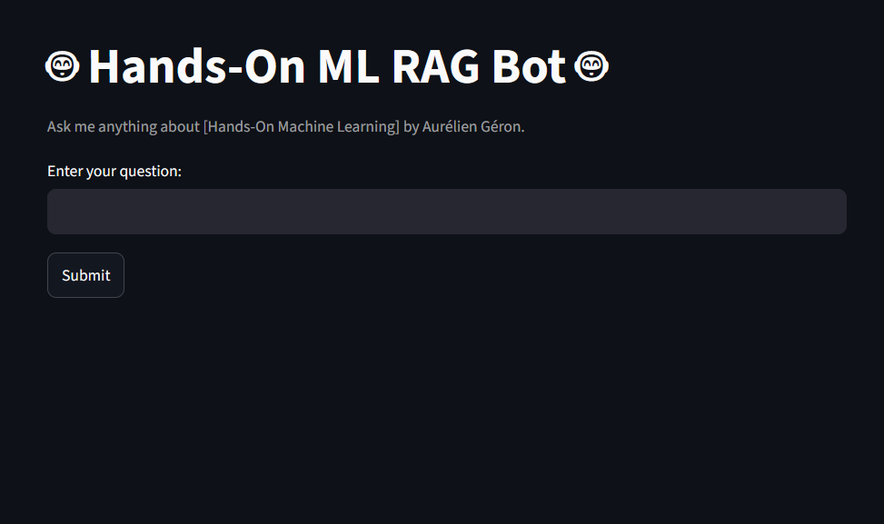
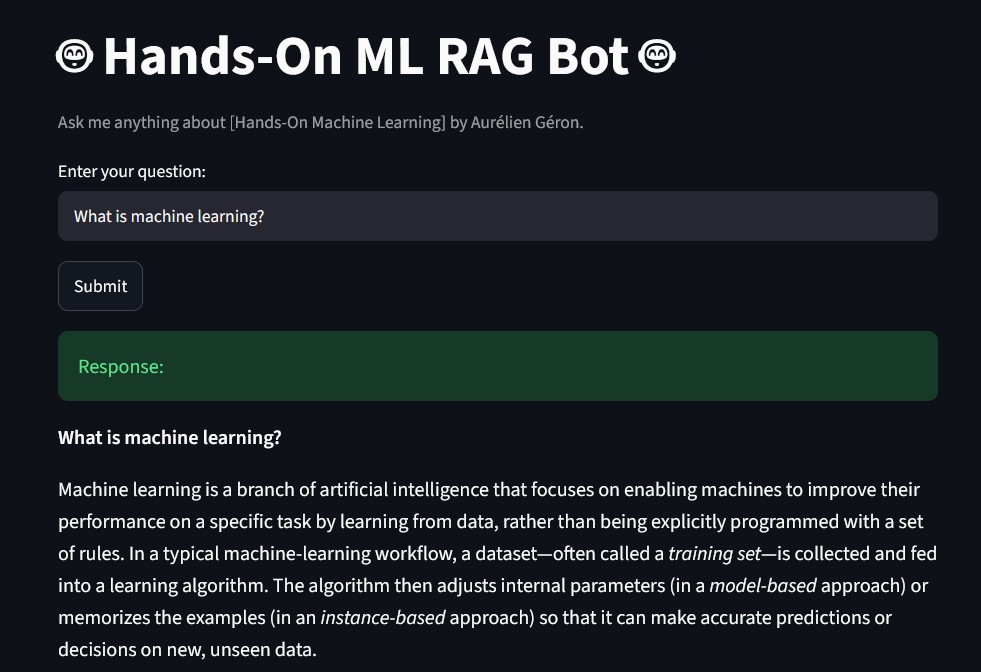

# Hands-On ML RAG Bot 🤖

*Created by [Ali Hmidov](https://github.com/Alihmidov) | [View on GitHub](https://github.com/Alihmidov/hands-on-rag-groq)*

**[🚀 TRY THE LIVE BOT HERE](https://hands-on-rag-groq-1.onrender.com)**
> ⏳ *Hosted on Render's free tier — first load may take up to 1 minute to wake up. Please wait, it will load!*

> Chat with the *Hands-On Machine Learning* book using Retrieval-Augmented Generation (RAG), semantic search, and Groq LLM.


### Home

<p align="center">

</p>

### Example Question

<p align="center">

</p>

# 📖 Overview

Searching through a technical machine learning textbook can be slow and inefficient.

Hands-On ML RAG Bot allows users to ask natural language questions and receive answers grounded in the contents of the book.

The application follows the Retrieval-Augmented Generation (RAG) workflow:

- retrieve relevant book passages
- provide them to the LLM
- generate a context-aware answer

This approach significantly reduces hallucinations while improving factual accuracy.

---

# ✨ Features

- Semantic similarity search
- Retrieval-Augmented Generation (RAG)
- Context-aware responses
- FastAPI backend
- Streamlit web interface
- Groq LLM integration
- HuggingFace embeddings
- ChromaDB vector database

---

# 🛠 Tech Stack

| Component | Technology |
|------------|------------|
| Backend | FastAPI |
| Frontend | Streamlit |
| LLM | Groq |
| Embeddings | HuggingFace Endpoint Embeddings |
| Framework | LangChain |
| Vector Database | ChromaDB |
| PDF Processing | PyMuPDF |
| Language | Python 3.13 |
| Package Manager | uv |
| Deployment | Docker + Render |

---

## 🚀 Installation

## Clone Repository

```bash
git clone https://github.com/Alihmidov/hands-on-rag-groq.git

cd hands-on-rag-groq
```

## Install Dependencies

```bash
uv sync
```

## Configure Environment

Create a `.env` file:

```env
HF_API_TOKEN=your_huggingface_token

GROQ_API_KEY=your_groq_api_key
```

## Build Vector Database (Optional)

```bash
uv run python app/core/ingestion.py
```

> A precomputed ChromaDB database is already included, so this step is optional.

## Start the Application

Backend

```bash
uv run uvicorn app.main:app --reload
```

Frontend

```bash
uv run streamlit run app/ui.py
```

---

# 🐳 Docker

Build and start the application:

```bash
docker compose up --build
```

Or run it in detached mode:

```bash
docker compose up -d
```

Stop the containers:

```bash
docker compose down
```

---

# 💬 Example Questions

- What is Machine Learning?
- Explain Gradient Descent.
- Explain Random Forest.
- What is Batch Normalization?
- What is Transfer Learning?
- How do Convolutional Neural Networks work?

---

# 🌐 Deployment

The application is containerized with Docker and deployed on **Render**.

Since the free Render plan automatically spins down after inactivity, the first request may take approximately one minute.

---
# 🔮 Future Improvements

- Conversation memory
- Chat history
- Source citations
- Streaming responses
- Hybrid Search 
- PDF upload support
- Multi-document support

---

# 👤 Author

**Ali Hmidov**

GitHub: https://github.com/Alihmidov
